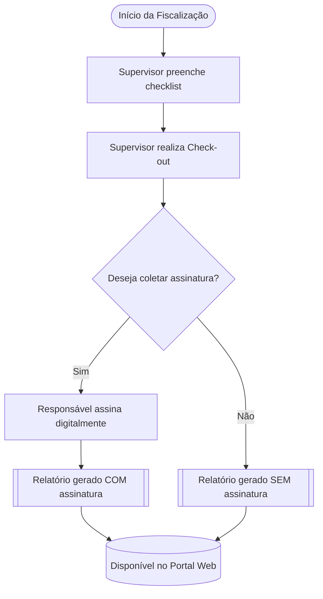

# Configurações de Posto 4SUP

## Configurações de Posto no GesOper Corporate 

Todo posto cadastrado no GesOper pode ser utilizado como ponto de fiscalização pelo supervisor. No sistema, as agendas representam as rotinas de fiscalização que serão executadas nesses locais.  

Para que um posto esteja apto a receber fiscalizações no 4SUP, é necessário que alguns elementos estejam corretamente configurados:  

!!! info "1. Supervisor associado ao posto"
    O supervisor deve estar corretamente vinculado ao posto para visualizar o local no aplicativo e receber agendas.

    O supervisor precisa estar vinculado ao posto para que o aplicativo exiba as agendas e permita o registro da fiscalização.  

    Sem esse vínculo, o 4SUP bloqueia o acesso operacional para esse posto.

!!! info "2. Checklist de Fiscalização habilitado"
Cada posto deve possuir ao menos um checklist associado.

!!! info "3. Geolocalização (latitude e longitude)"
    As coordenadas do posto são essenciais para que o 4SUP valide a presença do supervisor durante o início da fiscalização.  
    Sem valores válidos de latitude e longitude, o aplicativo pode impedir o check-in ou registrar a posição de forma incorreta.

    A tela de configuração de posto também permite associar periodicidades de fiscalização, definindo intervalos mínimos e máximos entre visitas.  
    Com isso, o sistema gera agendas automáticas conforme as regras estabelecidas pela empresa, respeitando dias permitidos, turnos (diurno/noturno) e a lógica de sorteio quando ambos os turnos são aceitos.

## Latitude e Longitude do Posto

### Importância da Geolocalização

A configuração correta da **latitude e longitude** do posto é fundamental para que o GesOper e o aplicativo 4SUP validem a posição do supervisor durante a fiscalização.

O sistema pode ser configurado para permitir o início da agenda **somente quando o supervisor estiver dentro de um raio de distância permitido**, garantindo segurança e precisão operacional.

Sem coordenadas válidas, o aplicativo pode:

- impedir o início da agenda;  
- registrar localizações inconsistentes;  
- bloquear o check-in por estar “fora da área”.  

---

### Obtendo a Localização no Google Maps

Para descobrir a latitude e longitude do posto:

1. Acesse o **Google Maps**.  
2. Pesquise pelo endereço, nome do local ou ponto de referência.  
3. Confirme o marcador vermelho indicando o local correto.  
4. Use esse ponto como referência para capturar as coordenadas.

<figure markdown>
  
  <figcaption align="center">Localização marcada no Google Maps</figcaption>
</figure>

---

### Capturando e Cadastrando as Coordenadas

1. Clique com o **botão direito** do mouse sobre o marcador vermelho no Google Maps. As coordenadas serão exibidas na parte superior do menu. 
2. As coordenadas aparecerão no formato:
-30.02658, -51.21205

markdown
Copiar código
3. No GesOper, substitua o **ponto** por **vírgula**, pois o sistema utiliza o formato brasileiro.

Exemplo:

- **Google Maps →** `-30.02658`  
- **GesOper →** `-30,02658`

Com as coordenadas cadastradas corretamente, o posto passa a permitir:

- validação precisa do supervisor no local;  
- início adequado de agendas;  
- controle de presença e auditoria;  
- geração coerente de relatórios.

<figure markdown>

<figcaption align="center">Captura das coordenadas no Google Maps</figcaption>
</figure>

---

### Inserindo no GesOper

Depois de obter os valores corrigidos (com vírgula), insira-os nos campos:

- **Latitude**  
- **Longitude**

Dentro da tela de **Cadastro de Posto**.

<figure markdown>

<figcaption align="center">Campos de latitude e longitude no GesOper</figcaption>
</figure>

## Supervisor associado ao posto

No posto desejado, é possível associar **supervisores responsáveis pelas fiscalizações**. Os funcionários vinculados como supervisores passam a ter permissão para:

- realizar agendas de fiscalização;  
- registrar checklists e evidências;  
- acompanhar ocorrências;  
- e, quando autorizado pela empresa, criar novas agendas diretamente pelo aplicativo 4SUP ou pelo Portal Web.

> *(Clique aqui para revisar as configurações de empresa.)*

O sistema permite associar **quantos supervisores forem necessários** a um mesmo posto.

---

### Supervisores noturnos

Além dos supervisores regulares, o GesOper permite cadastrar **supervisores noturnos**, responsáveis por fiscalizações exclusivas no período configurado como noturno pela empresa.  
Esse recurso garante controle de turnos e distribuição coerente das agendas;  

---

## Vinculando supervisores ao posto

Na aba **Supervisão**, clique no botão **Supervisores** e adicione os funcionários que atuarão como responsáveis pela fiscalização do posto.

Após incluir os supervisores, é possível **marcar** cada funcionário para associá-lo a uma **periodicidade de fiscalização** previamente configurada.

> *(Clique aqui para revisar a periodicidade de fiscalização.)*

---

## Impacto da periodicidade na geração de agendas

Quando um supervisor possui uma periodicidade vinculada, ele passa a ser submetido às regras configuradas, incluindo:

- intervalo mínimo e máximo entre visitas;  
- dias da semana permitidos;  
- turnos (diurno/noturno);  
- sorteio do turno quando ambos são permitidos.

---

## Ordem de prioridade na geração das agendas

A **ordem** dos supervisores na lista determina a **prioridade** de geração das agendas periódicas.

!!! example "Como funciona a prioridade"
    Se dois supervisores possuem a mesma periodicidade e ambos são elegíveis para receber agendas no mesmo posto:

    - O sistema **prioriza** o supervisor que estiver **mais acima** na ordem.  
    - Caso o primeiro da lista não esteja elegível (ex.: férias, desligamento, ausência, desmarcado), o próximo da lista recebe a agenda.

Essa hierarquia garante que a distribuição das fiscalizações siga critérios definidos pela empresa, podendo refletir:

- senioridade;  
- responsabilidades operacionais;  
- escala de trabalho;  
- disponibilidade;  
- regras internas de alocação.

---

## Peridiocidade de Fiscalização

!!! info "Vinculando periodicidade ao posto"

    O cadastro e o conceito de **periodicidade de fiscalização** podem ser consultados *(aqui)*.  
    Para associar essas regras já configuradas a um posto, clique no botão **Configuração** e acesse a aba **Ficha 2**.  
    Nessa tela, você poderá definir quais periodicidades serão aplicadas aos supervisores responsáveis pelo posto.

    A periodicidade determina **o intervalo em que o sistema irá gerar agendas automáticas**, obedecendo:
    
    - dias permitidos,  
    - turnos (diurno e/ou noturno),  
    - intervalo mínimo e máximo entre fiscalizações.

    Somente os supervisores que estiverem marcados na aba Supervisão **e associados ao código da periodicidade** poderão receber agendas automáticas geradas pelo sistema.

---

!!! note "Data Inicial de Fiscalização"

    A **Data Inicial de Fiscalização** define a partir de quando o posto poderá receber agendas automáticas baseadas na periodicidade configurada.

    **Exemplo:**  
    Se a data cadastrada for **01/01/2025**, o posto somente passará a receber agendas periódicas **a partir dessa data**, mesmo que a periodicidade e os supervisores já estejam configurados antes.

---

!!! tip "Dica prática"
    Caso um posto pare de receber agendas automáticas, verifique sempre estes três pontos:
    
    1. Supervisores marcados corretamente  
    2. Periodicidade vinculada na aba Ficha 2  
    3. Data Inicial de Fiscalização não está no futuro

## Exemplos de Funcionamento da Periodicidade de Fiscalização

!!! example "Exemplo 1 — Periodicidade fixa (2 em 2 dias)"
    **Periodicidade:** Entre 2 e 2 dias  
    **Data inicial:** 01/01/2025  
    **Supervisor marcado:** João

    Linha do tempo:

    | Data       | Evento |
    |------------|--------|
    | 01/01/2025 | Início da vigência da periodicidade |
    | 03/01/2025 | 1ª agenda gerada automaticamente |
    | 05/01/2025 | 2ª agenda gerada |
    | 07/01/2025 | 3ª agenda gerada (e assim por diante) |

    Se nenhum supervisor estiver marcado, **nenhuma agenda será gerada**, mesmo com periodicidade configurada.

!!! example "Exemplo 2 — Periodicidade variável (entre 3 e 5 dias)"
    **Periodicidade:** Entre 3 e 5 dias  
    **Dias permitidos:** Terça, Quinta e Sábado  
    **Turno:** Diurno  
    **Data inicial:** 10/02/2025

    Funcionamento passo a passo:

    1. Sistema escolhe um intervalo aleatório: **4 dias**  
    2. Data calculada: **14/02/2025 (sexta)**  
    3. Sexta-feira não está permitida  
    4. Próximo dia permitido: **15/02/2025 (sábado)**  
    5. Agenda gerada em **15/02/2025**

    O sistema sempre ajusta para o próximo dia permitido quando a data calculada não é válida.

!!! example "Exemplo 3 — Dois supervisores com a mesma periodicidade"
    **Periodicidade:** 2 a 3 dias  
    **Supervisores marcados:** Ana e Pedro  
    **Ordem de prioridade:**  
    1. Ana  
    2. Pedro

    Regra de distribuição:

    - Se Ana estiver disponível → **ela recebe a agenda primeiro**
    - Se Ana não puder receber (férias, desligada, desmarcada) → **Pedro recebe**
    - A periodicidade é a mesma, mas a **ordem na lista define a prioridade**
    - (*A disponibilidade de um supervisor depende se o funcionário em questão tem escala e jornada)

!!! example "Exemplo 4 — Supervisor noturno"
    **Horário do turno noturno:** A partir das 19h  
    **Supervisores marcados:**  
    - Carlos (diurno)  
    - Marcos (noturno)

    Distribuição:

    - Agendas geradas antes das 19h → **Carlos**
    - Agendas geradas após as 19h → **Marcos**
    - Se ambos possuírem periodicidade configurada e o turno for misto, o sistema poderá sortear, desde que o turno seja permitido para cada supervisor.

## Responsável do Cliente no Posto

O **Responsável do Cliente no Posto** é a pessoa indicada pela contratante para validar e confirmar que a fiscalização realizada pelo supervisor foi executada corretamente. Antes do *check-out* da agenda, o 4SUP pode solicitar que esse responsável assine digitalmente a conclusão da visita.

A assinatura confirma que:

- A auditoria foi realizada no local;  
- Todos os itens da checklist foram verificados;  
- Fotos e evidências foram registradas;  
- O supervisor concluiu o trabalho conforme o esperado.

---

## Por que essa assinatura é importante?

!!! info "Finalidade da assinatura"
    A assinatura do responsável atua como **validação formal** da fiscalização, servindo como evidência operacional entre a empresa prestadora e o cliente.  
    Ela garante:
    
    - Transparência no processo de auditoria  
    - Registro oficial da fiscalização  
    - Credibilidade no histórico de visitas  
    - Segurança contratual

---

## Cadastro dos Responsáveis do Cliente

O cadastro é feito no módulo de clientes do GesOper.

**Caminho:**  
`Operacional → Cadastros → Clientes e Fornecedores → Clientes`

1. Selecione o cliente desejado.  
2. Clique em **Contatos** (canto inferior direito).  
3. Cadastre:
   - Nome completo  
   - Telefone  
   - E-mail  
   - Cargo / Função  
   - Observações (opcional)

!!! tip "Dica"
    Cadastre **mais de um responsável** quando o cliente possuir diferentes turnos, mudanças frequentes ou substituições regulares no posto.

---

## Figura: Tela de Cadastro de Contatos do Cliente

<figure markdown>
  
  <figcaption align="center">Exemplo de tela de cadastro de contatos do cliente (substitua pelo print real)</figcaption>
</figure>

---

## Vinculação do Responsável ao Posto

Depois de cadastrado no cliente, o responsável deve ser vinculado ao posto.

!!! example "Exemplo de vínculo"
    - Cliente: **Condomínio Alfa**  
    - Postos: Portaria 1, Portaria 2, Garagem  
    - Responsável: João da Silva  

    Ao vincular João aos três postos, qualquer fiscalização nesses locais poderá solicitar sua assinatura no *check-out*.

---

## Assinatura no Relatório de Supervisão

A assinatura coletada pelo 4SUP é automaticamente exibida:

- No **Relatório de Supervisão**  
- No **Relatório de Checklist**  

!!! note "Como a assinatura aparece"
    A assinatura é adicionada ao final do relatório com:
    - Nome do responsável  
    - Horário do *check-out*  
    - Nome do supervisor  
    - Posto fiscalizado  
    - Código do contrato  

---

## Figura: Exemplo de Assinatura no Relatório

<figure markdown>
  
  <figcaption align="center">Exemplo ilustrativo da assinatura do responsável no relatório</figcaption>
</figure>

---

# Fluxograma: Processo Completo da Assinatura

